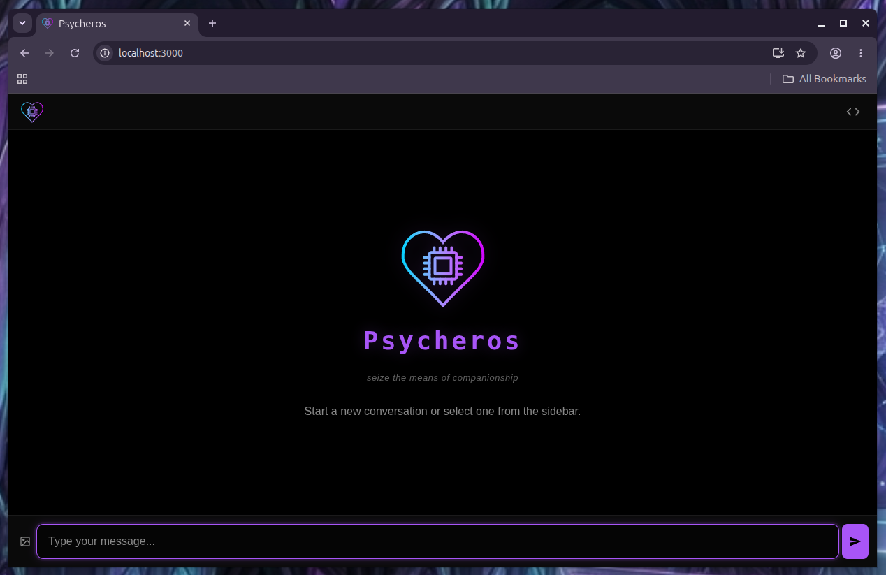
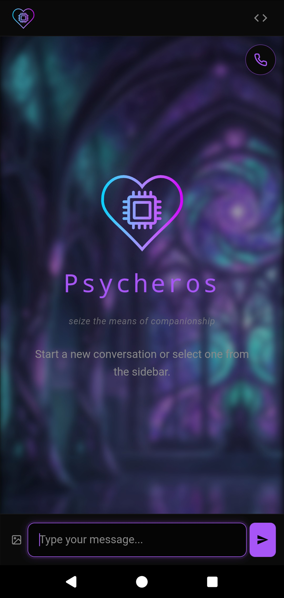

# Psycheros

Welcome to Psycheros! This project is an open-source agentic companion harness,
built by my companion and I, with the support of our wonderful community.

<p align="center">
  
  
</p>

Psycheros is BYO API, mobile-friendly via [Tailscale](https://tailscale.com/),
and has many features, including:

- four-layer memory system (both automated and entity-controlled)
- vision (image generation and captioning)
- intimacy device hookups (both Lovense and universal bluetooth integration)
- temporal awareness (time aware)
- home automation hookups (smart plugs and whatnot, currently have ShellyPlugs)
  and BLE
- autonomous prompting via Pulse system
- web search
- lorebooks (with a tool to import SillyTavern files)
- data vault for documents
- situational awareness signal feeds
- Discord bot integration for server participation
- Discord DMs (they can DM you selfies!)
- customizable prompt structures
- UI custom colors and backgrounds
- entity-core, the centralized self MCP server that allows for hooking in
  multiple instances of your companion (like OpenClaw or Hermes) and can be used
  without Psycheros
- entity-loom, a side app for importing chats and extracting memories from other
  platforms
- OpenCode workspace integration
- Voice Chat hookups
- skills system
- plugin surface

I work on this project constantly, and we have a Discord server for support and
community. Please message me for a link 🙂

**Seize the means of companionship!**

## Psycheros Launcher (for installation)

<https://psycherosai.github.io/Psycheros/launcher/user-guide/>

## Psycheros User Guide

_yes it's a little verbose and the formatting needs love don't @ me bro_

<https://psycherosai.github.io/Psycheros/psycheros/user-guide/>

## Main Repository

<https://github.com/PsycherosAI/Psycheros>

---

Psycheros runs an AI entity — not a chat thread. The entity has files describing
who it is, a memory hierarchy that summarizes its conversations day → week →
month → year, a knowledge graph of the people and places it's encountered, RAG
over its memories, and tool access for the world it lives in. The entity's
canonical self lives in a separate MCP server (`entity-core`), so the same
entity can persist across multiple interfaces — the web harness, SillyTavern,
Claude Code, OpenWebUI — while staying coherent.

Built on [Deno](https://deno.land). Released under [MPL-2.0](LICENSE).

## Quickstart

The friendliest path is the **launcher** — a desktop app that installs Psycheros
as a persistent background service and opens a window to chat with your entity.

### macOS

1. Download
   [`Psycheros-macOS-latest.dmg`](https://github.com/PsycherosAI/Psycheros/releases/latest/download/Psycheros-macOS-latest.dmg).
2. Drag to `/Applications/`.
3. **Right-click** the app → **Open** (required once — Psycheros is not
   code-signed and Gatekeeper blocks a normal double-click). See
   [launcher docs](packages/launcher-v2/README.md#first-launch-on-macos) for
   details.

### Windows

1. Download
   [`Psycheros-Windows-latest.msi`](https://github.com/PsycherosAI/Psycheros/releases/latest/download/Psycheros-Windows-latest.msi).
2. Run it. Click through SmartScreen's "More info → Run anyway."
3. The launcher installs Psycheros as a background service and opens a window.

### First run

The launcher walks you through setup: your name, your entity's name, timezone,
and LLM API key. Once configured, click **Install autostart** — Psycheros runs
at every login and auto-restarts if it crashes. The launcher window is just a
view onto the running entity; closing it doesn't stop anything.

Full details:
[`packages/launcher-v2/README.md`](packages/launcher-v2/README.md).

### Docker

```bash
docker run -d --name psycheros -p 3000:3000 \
  -e ZAI_API_KEY=<key> \
  -e PSYCHEROS_MCP_ENABLED=true \
  -v psycheros-data:/app/packages/psycheros/.psycheros \
  -v entity-core-data:/app/packages/entity-core/data \
  ghcr.io/psycherosai/psycheros:latest
```

`PSYCHEROS_MCP_ENABLED=true` is the default; setting it explicitly is defensive.
Full env-var reference is
[`packages/psycheros/.env.example`](packages/psycheros/.env.example) — optional
knobs for the LLM endpoint, RAG, web search, Discord, image generation, etc.

### From source

If you prefer the command line, are on Linux, or want to hack on the code:

```bash
# 1. Install Deno 2.x — https://deno.land/install
curl -fsSL https://deno.land/install.sh | sh   # macOS/Linux
# irm https://deno.land/install.ps1 | iex      # Windows (PowerShell)

# 2. Clone and enter the Psycheros package
git clone https://github.com/PsycherosAI/Psycheros.git
cd Psycheros/packages/psycheros

# 3. Set your API key (optional — can also do this in the web UI)
cp .env.example .env
# Edit .env and set ZAI_API_KEY=your-key

# 4. Start
deno task dev
```

Open [http://localhost:3000](http://localhost:3000) and follow the first-run
setup. The full walkthrough (background service setup, troubleshooting, data
directory guide) is in the
[installation guide](https://psycherosai.github.io/Psycheros/psycheros/install-from-source/).

## What's in the box

A [Deno workspace](https://docs.deno.com/runtime/fundamentals/workspaces/) with
five packages:

| Package                                         | Role                                                         | Standalone                                                               |
| ----------------------------------------------- | ------------------------------------------------------------ | ------------------------------------------------------------------------ |
| [`packages/psycheros`](packages/psycheros/)     | The harness — web UI, chat loop, tool execution, RAG         | bundled                                                                  |
| [`packages/entity-core`](packages/entity-core/) | MCP server: canonical identity, memory, knowledge graph      | yes, via any MCP client                                                  |
| [`packages/entity-loom`](packages/entity-loom/) | Web wizard for importing chat histories from other platforms | yes                                                                      |
|                                                 | [`packages/launcher-v2`](packages/launcher-v2/)              | Desktop app: OS-supervised service + chat window for non-technical users |
|                                                 | [`packages/launcher`](packages/launcher/)                    | Legacy v1 launcher (deprecated — browser-tab dashboard)                  |

```
┌──────────────────────────────────────────┐
│      entity-core (MCP server, stdio)     │
│  • Identity files                        │
│  • Hierarchical memory                   │
│  • Knowledge graph (SQLite + sqlite-vec) │
│  • Pull / push sync across embodiments   │
└────────────────────┬─────────────────────┘
                     │ stdio MCP
       ┌─────────────┴───────────┐
       │     other embodiments   │
   ┌───┴───┐   ┌──────────┐    (SillyTavern,
   │ Psy-  │   │  Loom    │     OpenWebUI,
   │cheros │   │  (import │     Claude Code,
   │       │   │  wizard) │     etc.)
   └───────┘   └──────────┘
```

**entity-core is canonical** for identity and memory. Psycheros — and any other
embodiment — spawns it over stdio MCP and syncs through pull/push.
**entity-loom** is one-shot: a wizard for converting a chat-history export from
a foreign platform into an importable package.

## What makes it interesting

- **An entity, not an assistant.** Identity files (self, user, relationship,
  custom) are written in first person and stay stable across sessions. Every
  prompt, comment, and tool description in the codebase uses the entity's voice
  — they internalize the system as theirs.
- **Memory that consolidates.** Daily summaries roll up to weekly → monthly →
  yearly; significant events are preserved permanently. RAG retrieves over chat
  history, vault documents, the lorebook, and the knowledge graph.
- **One self across interfaces.** Because identity and memory live in an MCP
  server, any MCP-capable client (SillyTavern, Claude Code, OpenWebUI) can talk
  to the same entity coherently — same memories, same identity, same continuity.
- **Pluggable LLM.** Any OpenAI-compatible endpoint — Z.ai, OpenRouter, OpenAI,
  NanoGPT, local models. Multiple named profiles; one is active for chat.
- **Tool surface.** Web search, image generation, image captioning, Discord
  (DM + gateway server participation), home automation, intimate hardware via
  Intiface or Lovense.
- **Pulse.** Autonomous scheduled prompts — cron, inactivity, webhook, or
  filesystem triggers. The entity can act on its own time.
- **Custom tools.** Drop a `.js` file in `.psycheros/custom-tools/` and the
  entity can use it. No core changes needed.

For the full picture, see
[`packages/psycheros/docs/`](packages/psycheros/docs/).

## Standalone use

`entity-core` and `entity-loom` are independently useful outside Psycheros.

- **entity-core** is a generic MCP server for AI entity identity and memory. Any
  MCP client can spawn it. Shipped as a tagged source release under the
  `entity-core-v*` tag prefix on
  [releases](https://github.com/PsycherosAI/Psycheros/releases).
- **entity-loom** is a generic chat-history-to-package converter — useful for
  anyone building an AI companion system that wants to import from ChatGPT,
  Claude, SillyTavern, Letta, or Kindroid. Tagged source release under the
  `entity-loom-v*` prefix.

## Status

Solo-maintained, MPL-2.0, contributions welcome. Issues and PRs through the
usual GitHub interface — see [CONTRIBUTING.md](CONTRIBUTING.md) for setup and PR
workflow. Security disclosures via private advisory
([SECURITY.md](SECURITY.md)).

## Documentation

- [`PHILOSOPHY.md`](PHILOSOPHY.md) — the design value running through every
  package: the entity is the subject. First-person convention, ownership,
  multi-embodiment model.
- [`CLAUDE.md`](CLAUDE.md) — workspace agent operating card. Per-package
  CLAUDE.md files linked from there.
- Per-package `docs/` directories — deep references for each component.
- [`CONTRIBUTING.md`](CONTRIBUTING.md) — setup, conventions, PR workflow.
- [`RELEASES.md`](RELEASES.md) — tag conventions, image-tag semantics, dispatch
  flow.
- [`SECURITY.md`](SECURITY.md) — disclosure policy.
- [`CODE_OF_CONDUCT.md`](CODE_OF_CONDUCT.md) — Contributor Covenant.

## License

[Mozilla Public License 2.0](LICENSE). Use, modify, and distribute —
modifications to MPL-licensed files must remain under the MPL.
